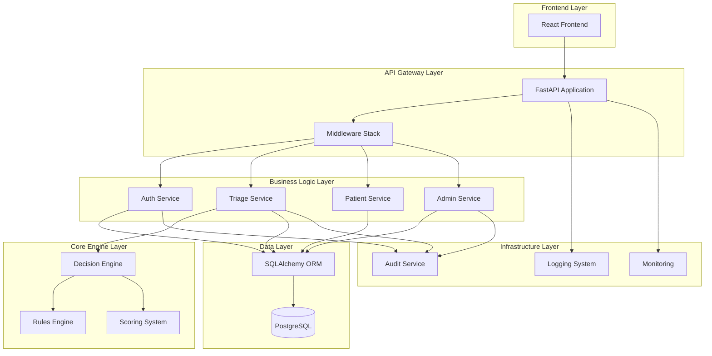

# Design Document

## Overview

This design document outlines the architecture for refactoring Lodge Optical from a Node.js/Firebase system to a sovereign FastAPI backend with PostgreSQL. The design emphasizes domain-driven architecture, security hardening, comprehensive observability, and evolutionary capability while maintaining the core triage intelligence that defines the system's value proposition.

The architecture follows a layered approach with clear separation between API controllers, business services, data access, and the core triage engine. This separation ensures maintainability, testability, and the ability to evolve individual components without system-wide impact.

## Architecture

### High-Level Architecture



### Directory Structure

```
backend/
├── app/
│   ├── main.py                 # FastAPI application entry point
│   ├── core/
│   │   ├── __init__.py
│   │   ├── config.py           # Configuration management
│   │   ├── database.py         # Database connection and session management
│   │   ├── security.py         # JWT, password hashing, auth utilities
│   │   ├── logging.py          # Logging configuration
│   │   └── exceptions.py       # Custom exception classes
│   ├── modules/
│   │   ├── __init__.py
│   │   ├── auth/
│   │   │   ├── __init__.py
│   │   │   ├── router.py       # Auth endpoints
│   │   │   ├── service.py      # Auth business logic
│   │   │   ├── schemas.py      # Pydantic models for auth
│   │   │   └── models.py       # SQLAlchemy models for users/roles
│   │   ├── triage/
│   │   │   ├── __init__.py
│   │   │   ├── router.py       # Triage endpoints
│   │   │   ├── service.py      # Triage orchestration
│   │   │   ├── schemas.py      # Triage input/output models
│   │   │   └── models.py       # Triage session/result models
│   │   ├── patient/
│   │   │   ├── __init__.py
│   │   │   ├── router.py       # Patient CRUD endpoints
│   │   │   ├── service.py      # Patient business logic
│   │   │   ├── schemas.py      # Patient data models
│   │   │   └── models.py       # Patient SQLAlchemy models
│   │   ├── admin/
│   │   │   ├── __init__.py
│   │   │   ├── router.py       # Admin endpoints
│   │   │   ├── service.py      # Admin operations
│   │   │   ├── schemas.py      # Admin request/response models
│   │   │   └── models.py       # Admin-specific models
│   │   └── audit/
│   │       ├── __init__.py
│   │       ├── service.py      # Audit logging service
│   │       ├── schemas.py      # Audit log models
│   │       └── models.py       # Audit trail database models
│   ├── engine/
│   │   ├── __init__.py
│   │   ├── decision_engine.py  # Main triage orchestration
│   │   ├── rules.py           # Business rules and logic
│   │   ├── scoring.py         # Risk scoring algorithms
│   │   ├── schemas.py         # Engine-specific data models
│   │   └── exceptions.py      # Engine-specific exceptions
│   ├── middleware/
│   │   ├── __init__.py
│   │   ├── auth.py            # JWT authentication middleware
│   │   ├── audit.py           # Audit logging middleware
│   │   ├── rate_limit.py      # Rate limiting middleware
│   │   └── cors.py            # CORS configuration
│   └── api/
│       ├── __init__.py
│       └── router.py          # Main API router aggregation
├── migrations/                 # Database migration files
├── tests/
│   ├── __init__.py
│   ├── conftest.py            # Test configuration and fixtures
│   ├── test_auth/
│   ├── test_triage/
│   ├── test_patient/
│   ├── test_admin/
│   └── test_engine/
├── scripts/
│   ├── init_db.py             # Database initialization
│   ├── create_admin.py        # Create initial admin user
│   └── migrate.py             # Migration utilities
├── requirements.txt           # Python dependencies
├── .env.example              # Environment variables template
├── alembic.ini               # Database migration configuration
└── README.md                 # Setup and deployment instructions
```

## Components and Interfaces

### Core Configuration (app/core/)

**config.py**
- Environment variable management using Pydantic BaseSettings
- Database connection strings, JWT secrets, rate limiting configs
- Deployment environment detection (dev/staging/prod)

**database.py**
- SQLAlchemy engine and session factory
- Connection pooling and retry logic
- Database health check utilities

**security.py**
- JWT token creation, validation, and refresh logic
- Password hashing using bcrypt with configurable rounds
- Role-based permission checking utilities

### Authentication Module (app/modules/auth/)

**Interface Design:**
```python
# POST /auth/login
{
    "email": "user@example.com",
    "password": "secure_password"
}
# Response:
{
    "access_token": "jwt_token",
    "refresh_token": "refresh_jwt",
    "user": {
        "id": 1,
        "email": "user@example.com",
        "role": "staff"
    }
}

# POST /auth/refresh
{
    "refresh_token": "refresh_jwt"
}

# POST /auth/logout
# Invalidates current session
```

### Triage Module (app/modules/triage/)

**Interface Design:**
```python
# POST /triage
{
    "patient_id": 123,
    "symptoms": ["chest_pain", "shortness_of_breath"],
    "vital_signs": {
        "blood_pressure": "140/90",
        "heart_rate": 95,
        "temperature": 98.6
    },
    "medical_history": ["hypertension"],
    "current_medications": ["lisinopril"]
}
# Response:
{
    "session_id": "uuid",
    "risk_score": 7.5,
    "risk_level": "moderate",
    "recommendations": [
        "Schedule appointment within 24 hours",
        "Monitor blood pressure"
    ],
    "reasoning": "Elevated risk due to chest pain with hypertension history"
}
```

### Patient Module (app/modules/patient/)

**Interface Design:**
```python
# GET /patients?page=1&limit=20&search=john
# POST /patients
# GET /patients/{id}
# PUT /patients/{id}
# DELETE /patients/{id}
```

### Decision Engine (app/engine/)

**decision_engine.py**
- Main orchestration class that coordinates rules and scoring
- Input validation and preprocessing
- Result aggregation and recommendation generation

**rules.py**
- Modular rule system with pluggable rule classes
- Rule priority and conflict resolution
- Rule versioning for auditability

**scoring.py**
- Risk scoring algorithms with configurable weights
- Score normalization and calibration
- Historical score tracking for trend analysis

## Data Models

### Database Schema Design

```sql
-- System Control (Kill Switch)
CREATE TABLE system_flags (
    key VARCHAR(50) PRIMARY KEY,
    value BOOLEAN NOT NULL DEFAULT TRUE,
    description TEXT,
    updated_by INTEGER,
    updated_at TIMESTAMP DEFAULT NOW()
);

-- Users and Authentication
CREATE TABLE roles (
    id SERIAL PRIMARY KEY,
    name VARCHAR(50) UNIQUE NOT NULL,
    permissions JSONB NOT NULL,
    created_at TIMESTAMP DEFAULT NOW()
);

CREATE TABLE users (
    id SERIAL PRIMARY KEY,
    email VARCHAR(255) UNIQUE NOT NULL,
    password_hash VARCHAR(255) NOT NULL,
    role_id INTEGER REFERENCES roles(id),
    is_active BOOLEAN DEFAULT TRUE,
    last_login TIMESTAMP,
    failed_login_attempts INTEGER DEFAULT 0,
    locked_until TIMESTAMP,
    created_at TIMESTAMP DEFAULT NOW(),
    updated_at TIMESTAMP DEFAULT NOW()
);

CREATE TABLE user_sessions (
    id UUID PRIMARY KEY DEFAULT gen_random_uuid(),
    user_id INTEGER REFERENCES users(id) ON DELETE CASCADE,
    refresh_token_hash VARCHAR(255) NOT NULL,
    device_info JSONB,
    ip_address INET,
    user_agent TEXT,
    is_active BOOLEAN DEFAULT TRUE,
    expires_at TIMESTAMP NOT NULL,
    created_at TIMESTAMP DEFAULT NOW()
);

-- Patient Management
CREATE TABLE patients (
    id SERIAL PRIMARY KEY,
    first_name VARCHAR(100) NOT NULL,
    last_name VARCHAR(100) NOT NULL,
    date_of_birth DATE,
    email VARCHAR(255),
    phone VARCHAR(20),
    medical_record_number VARCHAR(50) UNIQUE,
    emergency_contact JSONB,
    created_at TIMESTAMP DEFAULT NOW(),
    updated_at TIMESTAMP DEFAULT NOW()
);

-- Triage System with Executable Rules
CREATE TABLE triage_sessions (
    id UUID PRIMARY KEY DEFAULT gen_random_uuid(),
    patient_id INTEGER REFERENCES patients(id),
    user_id INTEGER REFERENCES users(id),
    input_data JSONB NOT NULL,
    risk_score DECIMAL(4,2),
    risk_level VARCHAR(20),
    recommendations JSONB,
    reasoning TEXT,
    confidence_score DECIMAL(3,2),
    engine_version VARCHAR(20),
    rules_applied JSONB,
    created_at TIMESTAMP DEFAULT NOW()
);

CREATE TABLE triage_rules (
    id SERIAL PRIMARY KEY,
    name VARCHAR(100) NOT NULL,
    version VARCHAR(20) NOT NULL,
    conditions JSONB NOT NULL,  -- Executable rule conditions
    actions JSONB NOT NULL,     -- Score, priority, recommendations
    priority INTEGER DEFAULT 0,
    is_active BOOLEAN DEFAULT TRUE,
    created_by INTEGER REFERENCES users(id),
    created_at TIMESTAMP DEFAULT NOW()
);

-- Forensic Audit System
CREATE TABLE audit_logs (
    id SERIAL PRIMARY KEY,
    request_id UUID NOT NULL,
    user_id INTEGER REFERENCES users(id),
    session_id UUID REFERENCES user_sessions(id),
    action VARCHAR(100) NOT NULL,
    resource_type VARCHAR(50),
    resource_id VARCHAR(100),
    before_state JSONB,
    after_state JSONB,
    state_diff JSONB,
    payload_hash VARCHAR(64),
    ip_address INET,
    user_agent TEXT,
    created_at TIMESTAMP DEFAULT NOW()
);

-- Request Tracking for Behavioral Analysis
CREATE TABLE request_logs (
    id SERIAL PRIMARY KEY,
    request_id UUID NOT NULL,
    user_id INTEGER REFERENCES users(id),
    endpoint VARCHAR(200) NOT NULL,
    method VARCHAR(10) NOT NULL,
    status_code INTEGER,
    response_time_ms INTEGER,
    payload_size INTEGER,
    ip_address INET,
    user_agent TEXT,
    created_at TIMESTAMP DEFAULT NOW()
);

-- Performance Indexes
CREATE INDEX idx_users_email ON users(email);
CREATE INDEX idx_users_active ON users(email) WHERE is_active = true;
CREATE INDEX idx_sessions_active ON user_sessions(user_id) WHERE is_active = true;
CREATE INDEX idx_triage_sessions_patient ON triage_sessions(patient_id);
CREATE INDEX idx_triage_sessions_created ON triage_sessions(created_at);
CREATE INDEX idx_triage_input_gin ON triage_sessions USING GIN (input_data);
CREATE INDEX idx_triage_recommendations_gin ON triage_sessions USING GIN (recommendations);
CREATE INDEX idx_audit_logs_user_action ON audit_logs(user_id, action);
CREATE INDEX idx_audit_logs_created ON audit_logs(created_at);
CREATE INDEX idx_audit_logs_request ON audit_logs(request_id);
CREATE INDEX idx_request_logs_user_endpoint ON request_logs(user_id, endpoint);
CREATE INDEX idx_request_logs_created ON request_logs(created_at);

-- Materialized Views for Analytics
CREATE MATERIALIZED VIEW triage_stats AS
SELECT 
    risk_level,
    COUNT(*) as total_sessions,
    AVG(risk_score) as avg_score,
    DATE_TRUNC('day', created_at) as date
FROM triage_sessions 
GROUP BY risk_level, DATE_TRUNC('day', created_at);

CREATE MATERIALIZED VIEW user_activity_stats AS
SELECT 
    user_id,
    COUNT(*) as request_count,
    AVG(response_time_ms) as avg_response_time,
    DATE_TRUNC('hour', created_at) as hour
FROM request_logs 
GROUP BY user_id, DATE_TRUNC('hour', created_at);
```

### Pydantic Models

**Authentication Schemas:**
```python
class UserLogin(BaseModel):
    email: EmailStr
    password: str

class UserResponse(BaseModel):
    id: int
    email: str
    role: str
    is_active: bool

class TokenResponse(BaseModel):
    access_token: str
    refresh_token: str
    token_type: str = "bearer"
    user: UserResponse
```

**Triage Schemas:**
```python
class TriageInput(BaseModel):
    patient_id: int
    symptoms: List[str]
    vital_signs: Dict[str, Any]
    medical_history: List[str] = []
    current_medications: List[str] = []
    additional_notes: Optional[str] = None

class TriageResult(BaseModel):
    session_id: UUID
    risk_score: float
    risk_level: str
    recommendations: List[str]
    reasoning: str
    confidence_score: float
```

## Error Handling

### Exception Hierarchy

```python
class LodgeOpticalException(Exception):
    """Base exception for all application errors"""
    pass

class AuthenticationError(LodgeOpticalException):
    """Authentication and authorization errors"""
    pass

class ValidationError(LodgeOpticalException):
    """Input validation errors"""
    pass

class TriageEngineError(LodgeOpticalException):
    """Triage engine processing errors"""
    pass

class DatabaseError(LodgeOpticalException):
    """Database operation errors"""
    pass
```

### Error Response Format

```python
{
    "error": {
        "code": "VALIDATION_ERROR",
        "message": "Invalid input data",
        "details": {
            "field": "symptoms",
            "issue": "At least one symptom is required"
        },
        "request_id": "uuid"
    }
}
```

## Testing Strategy

### Test Categories

**Unit Tests**
- Individual function and method testing
- Mock external dependencies (database, external APIs)
- Focus on business logic validation

**Integration Tests**
- API endpoint testing with test database
- Database operation validation
- Authentication flow testing

**Engine Tests**
- Triage decision accuracy testing
- Rule application validation
- Score calculation verification

**Security Tests**
- Authentication bypass attempts
- Input validation boundary testing
- Rate limiting verification

### Test Data Management

- Use pytest fixtures for consistent test data
- Separate test database with automated cleanup
- Mock patient data that doesn't expose real information
- Parameterized tests for different triage scenarios

## Security Considerations

### Authentication Security

- Hybrid session-backed authentication (5-10 minute JWT + database session validation)
- Session records as source of truth with device/IP tracking
- Refresh token rotation with hashed storage in database
- Instant session invalidation capability for security incidents
- Rate limiting on authentication endpoints (5 attempts per minute)

### Data Protection

- Password hashing with bcrypt (12 rounds minimum)
- Input sanitization and validation on all endpoints
- SQL injection prevention through ORM parameter binding
- Sensitive data encryption at rest for PII fields

### API Security

- CORS configuration restricted to known frontend domains
- Security headers (HSTS, CSP, X-Frame-Options)
- Request size limits to prevent DoS attacks
- Comprehensive audit logging for security events

### Infrastructure Security

- Environment variable management for secrets
- Database connection encryption (SSL/TLS)
- API versioning to maintain backward compatibility
- Health check endpoints without sensitive information exposure